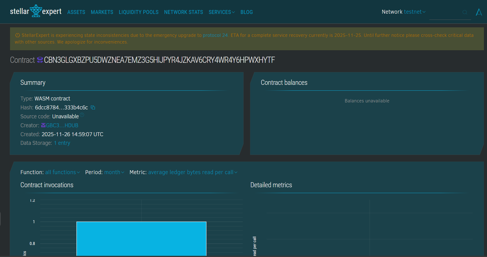

# SafeBid Market

## Project Title
SafeBid Market

## Project Description
SafeBid Market is a blockchain-based platform for fair bidding on wholesale or bulk product purchases. Developed with Soroban smart contracts on the Stellar blockchain, it enables transparent product listing, bid placement, bid acceptance, and rejection processes to facilitate trustworthy trading between buyers and sellers.

## Project Vision
This project looks to create an equitable marketplace that eradicates bid manipulation and increases trust by utilizing immutable smart contracts for bid handling, auditability, and enforcement of fair pricing rules, thus enhancing wholesale trading efficiency.

## Key Features
- Product Listings: Sellers list available products with quantity limits and pricing.
- Bid Placement: Buyers submit bids respecting seller constraints.
- Bid Management: Sellers can accept or reject bids transparently.
- Immutable Records: All listings and bids are stored securely on-chain.
- Authorization Controls: Only sellers can manage bids for their products.
- Status Tracking: Bids transition through statuses like pending, accepted, rejected.
- Public Access: Market participants can query listing and bid statuses.

## Usage Instructions
1. Sellers register products with wholesale terms.
2. Buyers submit bids within defined constraints.
3. Sellers review and decide on bids fairly.
4. Queries enabled for transparent market insights.

## Future Scope
- Escrow and automated payment release upon bid acceptance.
- Support for multi-commodity package bids.
- On-chain dispute resolution mechanisms.
- Integration with logistics and delivery services.
- Support for international trade and multi-currency bidding.
- Auction and reverse auction bidding styles.

## Technology Stack
- Soroban Rust SDK for secure, deterministic contract execution.
- Stellar blockchain as a decentralized, immutable ledger.
- Cryptographic verification and role control.

## Contribution
Welcomes blockchain developers, trading platform engineers, and supply chain experts to augment the platform functionality and trust. Contributions via forks and pull requests encouraged.

## License
This project is licensed under the MIT License.

### Contract Detail
ID : CBN3GLGXBZPU5DWZNEA7EMZ3G5HIJPYR4JZKAV6CRY4WR4Y6HPWXHYTF
